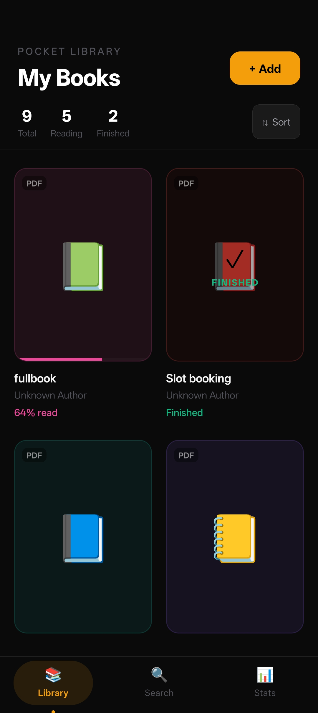
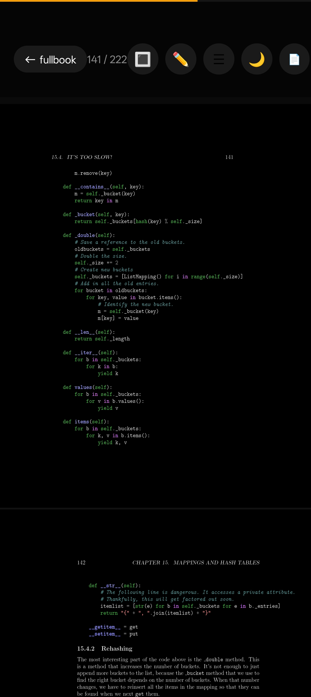
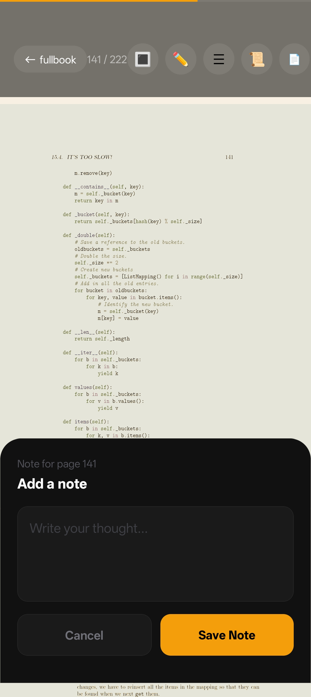
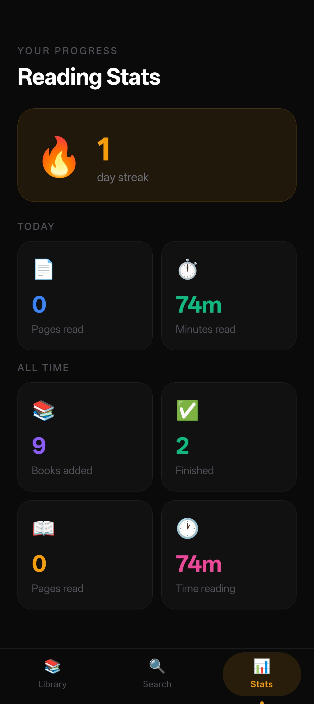

# 📚 Pocket Library (React Native + Expo)

A modern, minimal **book reading application** built with React Native and Expo.  
Designed to demonstrate clean architecture, state management, and real-world app features like reading progress, notes, and analytics.

<video controls src="Record_2026-03-17-15-17-49_f73b71075b1de7323614b647fe394240.mp4" title="Title"></video>

## 📸 Screenshots

|                                     📚 Library                                     |                                     📖 Reader                                     |                                     📝 Notes                                     |                                     📊 Stats                                     |
| :--------------------------------------------------------------------------------: | :-------------------------------------------------------------------------------: | :------------------------------------------------------------------------------: | :------------------------------------------------------------------------------: |
|  |  |  |  |

## ✨ Features

### 📚 Library / Shelf

- Grid layout with book covers
- Reading progress indicators
- Sorting support
- Import books from device
- Long press to delete books

### 📖 Reader (Core)

- PDF / ePub rendering (WebView-based)
- Page tracking
- Bookmark toggle
- Add notes per page
- Theme switcher (light/dark)
- Resume from last read page

### 📝 Notes

- View all notes & bookmarks per book
- Grouped by page
- Jump to page directly in reader

### 🔍 Search

- Search by title, author, and notes
- Real-time filtering

### 📊 Stats

- Reading streak
- Pages read today
- Total reading time
- Activity heatmap (last 52 weeks)

### ℹ️ Book Detail

- Title and author editing
- Progress visualization
- Bookmark & note counts
- Quick access to reader

## 🧱 Project Structure

app/
├── (tabs)/
│ ├── index.tsx # Library / Shelf
│ ├── search.tsx # Search
│ ├── stats.tsx # Stats
│
├── reader/
│ └── [id].tsx # Reader screen

## 🚀 Getting Started

```bash
npm install
npx expo start
```

## 🛠 Tech Stack

- React Native
- Expo
- Expo Router
- WebView
- Local storage / database

## 🧠 Development Priority

1. Reader
2. Notes
3. Stats
4. Search
5. Book Detail

## 📄 License

MIT License
